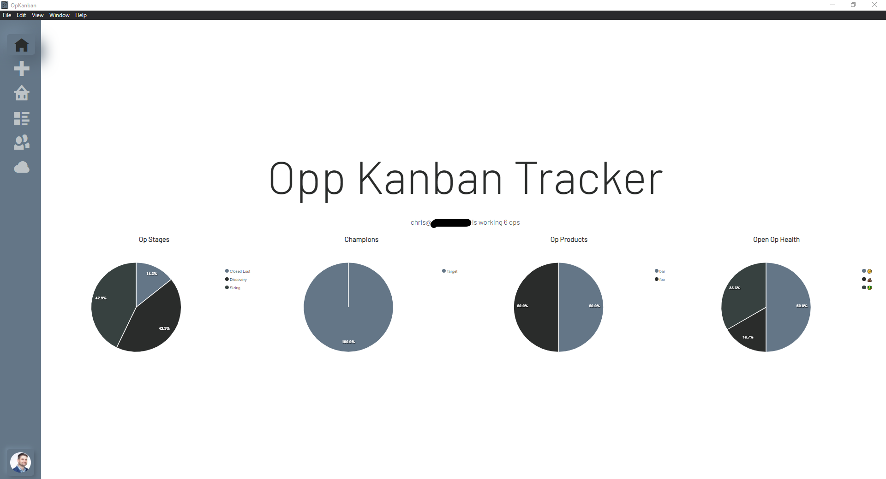
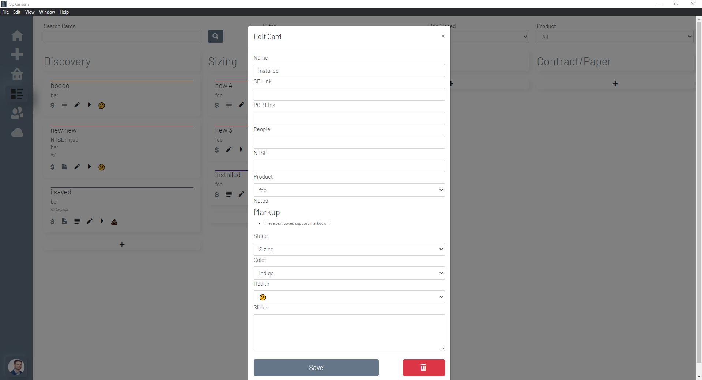

# Op Kanban

## Background
A simple Blazor Server app (with docker support or wrapped in Electron) to build out a some account management tasks for Solutions Architects. Data and authentication is using MongoDB Atlas and MongoDB Realm Sync.

## Features
* Run in Docker or Electron desktop app
* Track opportunities and details about them in a Kanban Board layout
* Tack contacts for the purposes of champion building

## Running yourself
### DB Prep
* Create an [Atlas](https://cloud.mongodb.com) cluster
* Deploy a Realm app for this cluster
* Turn on Realm Sync for a DB with a partition key `string` on `_pk`
* Create a collection in that DB called `KanbanTask` and set it's schema as that of [RealmSyncSchemaConfig.json](RealmSyncSchema.json)
* Turn on email/password authentication
* Create an account

### App Prep
* Git Clone this archive
* Copy the Realm App ID from Realm and replace the string in [Login.cs](OpKanban/OpKanban/Data/Login.cs)

## Option A - Docker
* You must have Docker installed and running
* Run [build.sh](OpKanban/build.sh) 
* App will start on port `666`

## Option B - Electron
* You must have [ElectronNET.CLI](https://www.nuget.org/packages/ElectronNET.CLI/) installed
* `cd` to the directory you cloned above 
* `cd` to OpKanban
* Run `electronize build /target win` to make a Windows Executable 
* Find the executable in `bin/Desktop` and run it to install

## Screenshots

